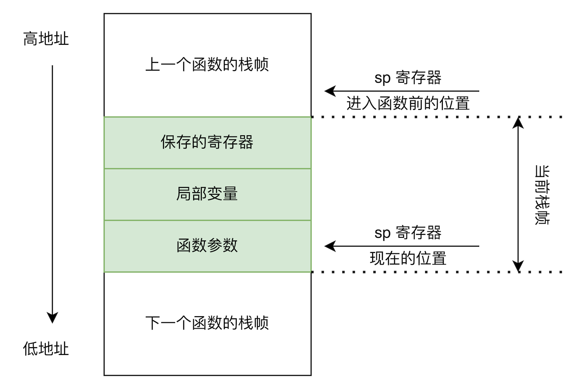
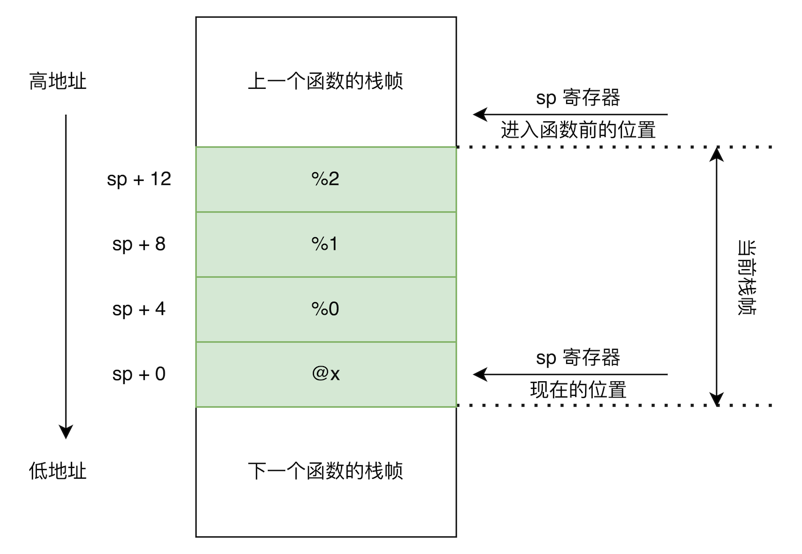

# Lv4.2. 变量和赋值

本节新增/变更的语法规范如下:

```ebnf
Decl          ::= ConstDecl | VarDecl;
ConstDecl     ::= ...;
BType         ::= ...;
ConstDef      ::= ...;
ConstInitVal  ::= ...;
VarDecl       ::= BType VarDef {"," VarDef} ";";
VarDef        ::= IDENT | IDENT "=" InitVal;
InitVal       ::= Exp;

...

Block         ::= ...;
BlockItem     ::= ...;
Stmt          ::= LVal "=" Exp ";"
                | "return" Exp ";";
```

## 一个例子

```c
int main() {
  int x = 10;
  x = x + 1;
  return x;
}
```

## 词法/语法分析

同上一节, 你需要设计新的 AST, 同时修改 parser 的实现.

## 语义分析

与上一节类似, 你依然需要一个符号表来管理所有的变量定义. 与常量定义不同的是, 变量定义存储的是变量的符号, 及其对应的 `alloc`, 即变量的内存分配. 本节的 IR 生成部分将解释 `alloc` 在 Koopa IR 中的含义.

所以, 你需要修改你的符号表, 使其支持保存一个符号所对应的常量信息或者变量信息. 也就是说, 符号表里使用符号可以查询到一个数据结构, 这个数据结构既可以用来存储变量信息, 又可以用来存储常量信息. 在 C/C++ 中, 你可以使用一个 `struct`, [tagged union](https://en.wikipedia.org/wiki/Tagged_union) 或者 `std::variant` 来实现这一性质. 在 Rust 中, 使用 `enum` (本身就是个 tagged union) 来实现这一性质再合适不过了.

在遇到 `LVal` 时, 你需要从符号表中查询这个符号的信息, 然后用查到的结果作为常量求值/IR 生成的结果. 注意, 如下情况属于语义错误:

* 在进行常量求值时, 从符号表里查询到了变量而不是常量.
* 在处理赋值语句时, 赋值语句左侧的 `LVal` 对应一个常量, 而不是变量.
* 其他情况, 如符号重复定义, 或者符号未定义.

## IR 生成

要想实现变量和赋值语句, 只使用我们之前介绍到的 Koopa IR 指令是做不到的. 比如你**不能**把本节的示例程序翻译成如下形式:

```koopa
// 错误的
fun @main(): i32 {
%entry:
  %0 = 10
  %0 = add %0, 1
  ret %0
}
```

虽然它 “看起来” 很符合常识. 但你也许还记得, 在 [Lv3.1](/lv3-expr/unary-exprs?id=ir-生成) 中我们介绍过, Koopa IR 是 **“单赋值”** 的, 所有符号都只能在定义的时候被赋值一次. 而在上面的程序中, `%0` 被赋值了两次, 这是不合法的.

如果要表示变量的定义, 使用和赋值, 我们必须引入三种新的指令: `alloc`, `load` 和 `store`:

```koopa
// 正确的
fun @main(): i32 {
%entry:
  // int x = 10;
  @x = alloc i32
  store 10, @x

  // x = x + 1;
  %0 = load @x
  %1 = add %0, 1
  store %1, @x

  // return x;
  %2 = load @x
  ret %2
}
```

三种新指令的含义如下:

* `%x = alloc T`: 申请一块类型为 `T` 的内存. 在本节中, `T` 只能是 `i32`. 返回申请到的内存的指针, 也就是说, `%x` 的类型是 `T` 的指针, 记作 `*T`.
  * 这个操作和 C 语言中 `malloc` 函数的惯用方式十分相似:

```c
// 申请一块可以存放 int 型数据的内存, 这块内存本身的类型是 int*
int *x = (int *)malloc(sizeof(int));
```

* `%x = load %y`: 从指针 `%y` 对应的内存中读取数据, 返回读取到的数据. 如果 `%y` 的类型是 `*T`, 则 `%x` 的类型是 `T`.
* `store %x, %y`: 向指针 `%y` 对应的内存写入数据, 不返回任何内容. 如果 `%y` 的类型是 `*T`, 则 `%x` 的类型必须是 `T`.

当然, 以防你忘记 Koopa IR 的规则, 再次提醒: 示例中的 `alloc` 叫做 `@x`, 是因为这个 `alloc` 对应 SysY 中的变量 `x`. 实际上, 这个 `alloc` 叫什么名字都行, 比如 `@AvavaAvA`, `%x` 或者 `%0`, 叫这个名字只是为了调试方便.

## 目标代码生成

本节中出现了新的 Koopa IR 指令, 这些指令要求我们进行内存分配. 实际上, 此处提到的 “内存分配” 可能和你脑海里的 “内存分配” 不太一样——后者在其他编程语言中通常指分配堆内存 (heap memory), 而此处指的**通常**是分配栈内存 (stack memory).

为什么要说 “通常”? 我们在之前的章节提到过, RISC-V 指令系统中定义了一些寄存器, 可供我们存放一些运算的中间结果. 我们都知道 (应该吧?), 计算机的存储系统分很多层次, 每一层的访问速度都存在数量级上的差距, 处理器访问寄存器的速度要远快于访问各级缓存和内存的速度. 如果我们能找到一种方法, 把 SysY/Koopa IR 程序中的变量映射到寄存器上, 那程序的速度肯定会得到大幅度提升.

事实上, 这种办法是存在的, 我们把这种方法叫做[寄存器分配](https://en.wikipedia.org/wiki/Register_allocation). 此时, `alloc` 对应的可能就不再是一块栈内存了, 而是一个 (或多个) 寄存器. 但要实现一种真正高效的寄存器分配算法是极为困难的: 寄存器分配问题本身是一个 [NPC](https://en.wikipedia.org/wiki/NP-completeness) 问题, 编译器必须消耗大量的时间才能算出最优的分配策略. 考虑到执行效率, 业界的编译器在进行寄存器分配时, 通常会采取一些启发式算法, 但这些算法的实现依旧不那么简单.

另一方面, 指令系统中定义的寄存器的数量往往是有限的, 比如 RISC-V 中有 32 个 ISA 层面的整数寄存器, 但其中只有不多于 28 个寄存器可以用来存放变量. 如果输入程序里的某个函数相对复杂, 编译器就无法把其中所有的变量都映射到寄存器上. 此时, 这些变量就不得不被 “spill” 到栈内存中.

你当然可以选择实现一些复杂的寄存器分配算法, 详见 [Lv9+.2. 寄存器分配](/lv9p-reincarnation/reg-alloc)的相关内容. 但此时, 我建议你先实现一种最简单的寄存器分配方式: **把所有变量都放在栈上.** 什么? 这也算是寄存器分配吗? 寄存器都没用到啊喂! 正所谓大道至简——你可以认为, 寄存器分配算法要做的事情是: 决定哪些变量应该被放在寄存器中, 哪些变量应该被放在栈上. 我们的算法只不过是固执地选择了后者……而已, 你很难说它不是一种寄存器分配算法.

在此之前, 你应该了解, RISC-V 程序中的栈内存是如何分配的.

### 栈帧

程序在操作系统中运行时, 操作系统会为其分配堆内存和栈内存. 其中, 栈内存的使用方式是连续的. 程序 (进程) 执行前, 操作系统会为进程设置栈指针 (stack pointer)——通常是一个[寄存器](https://en.wikipedia.org/wiki/Stack_register). 栈指针会指向栈内存的起点.

进程内, 在执行函数调用时, 函数开头的指令会通过移动栈指针, 来在栈上开辟出一块仅供这个函数自己使用的内存区域, 这个区域就叫做栈帧 (stack frame). 函数在执行的过程中, 会通过 “栈指针 + 偏移量” 的手段访问栈内存, 所以在函数退出前, 会有相关指令负责复原栈指针指向的位置, 以防调用这个函数的函数访问不到正确的栈内存.

至于栈内存为什么叫栈内存, 想必是很容易理解的: 函数在调用和返回的过程中, 栈内存中栈帧的变化, 就符合栈 LIFO 的特性.

那函数通常会在栈帧中存放什么内容呢? 最容易想到的是函数的返回地址. 所谓 “函数调用” 和 “函数返回” 的操作, 其实可以分解成以下几个步骤:

* **函数调用:** 把函数调用指令的后一条指令的地址存起来, 以便函数调用结束后返回. 然后跳转到函数的入口开始执行.
* **函数返回:** 找到之前保存的返回地址, 然后跳转到这个地址, 执行函数调用之后的指令.

由于函数的调用链可能非常之长, 函数的返回地址通常会被放在内存中, 而不是寄存器中. 因为相比于内存, 寄存器能存放的返回地址个数实在是少得可怜, 更何况寄存器还要用来存储变量和其他数据. 所以, 类似 “返回地址” 这种数据就可以被放在栈帧里.

扯点别的: 说到函数调用和返回, 你肯定会好奇 RISC-V 是怎么做的. 在 RISC-V 中, 函数的调用和返回可以通过 `call` 和 `ret` 这两条伪指令来完成. 我们之前提到过, “伪指令” 并不是 ISA 中定义的指令, 这些指令通常是用其他指令实现出来的. 比如 `call func` 这条伪指令代表调用函数 `func`, 它的实际上会被汇编器替换成:

```
auipc ra, func地址的高位偏移量
jalr  ra, func地址的低位偏移量(ra)
```

`auipc` 指令负责加载 `func` 的一部分地址到 `ra` 寄存器中. `jalr` 指令负责执行跳转操作: 把 `func` 剩下的一部分地址和 `ra` 里刚刚加载的地址相加得到完整地址, 然后把返回地址 (`jalr` 后一条指令的地址) 存入 `ra`, 最后跳转到刚刚计算得出的地址, 来执行函数.

首先为什么地址会被拆成两半? 因为 RV23I 里的地址和指令的长度都是 32 位, 要想在指令里编码其他内容 (比如指令的操作), 就必然不可能把整个地址全部塞进指令中.

然后你会发现, `call` 指令实际上会把返回地址放到 `ra` 寄存器中, 而不是直接放到栈上. 实际上, `ra` 寄存器的全名正是 “return address register”. 这是因为 RISC-V 是一种 RISC 指令系统, RISC 中为了精简指令的实现, 通常只有加载/存储类的指令能够访存, 其他指令只会操作寄存器.

`ret` 伪指令会被汇编器替换成:

```
jalr x0, 0(ra)
```

这条指令会读出 `ra` 寄存器的值, 加一个偏移量 0 (相当于没加) 得到跳转的目标地址, 然后把后一条指令的地址放到寄存器 `x0` 里, 最后跳转到刚刚计算出来的地址处执行.

首先我们之前曾提到 `x0` 是一个特殊的寄存器, 它的值恒为 0, 任何试图向写入 `x0` 写入数据的操作都相当于什么都没干, 所以这里的 `jalr` 相当于没写任何寄存器. 其次, `ra` 中存放的是函数的返回地址, 所以这条指令实际上相当于执行了函数返回的操作.

RISC-V 仅用一种指令就同时实现了函数调用和函数返回的操作 (`auipc` 只是加载了地址), 我们很难不因此被 RISC-V 的设计之精妙所折服. RISC-V 中还有很多其它这样的例子, 如你对此感兴趣, 可以查看 [RISC-V 规范](https://github.com/riscv/riscv-isa-manual/releases/download/Ratified-IMAFDQC/riscv-spec-20191213.pdf)第 139 页, 其中列举了很多伪指令和对应的实现方法.

但感慨之余, 你可能会意识到, RISC-V 的返回地址不直接保存在栈帧里, 而是被放在一个叫做 `ra` 的寄存器里——毕竟 RISC-V 有 32 个寄存器, 用掉一个也还有很多富余. 这么做其实有一个好处: 函数可以自由决定自己要不要把返回地址保存到栈帧里. 如果当前函数里没有再调用其他函数, 那 `ra` 的值就不会被覆盖, 我们就可以放心大胆地使用 `ret` 来进行函数返回, 同时节省一次内存写入的开销——事实上, 你的编译器到目前为止生成的 RISC-V 汇编都是这么处理的.

那么最后, 总结一下, 栈帧里通常会放这些东西:

* **函数的返回地址:** 上文已经解释过.
* **某些需要保存的寄存器:** 函数执行时可能会用到某些寄存器, 为了避免完成函数调用后, “调用者” 函数的寄存器被 “被调用者” 函数写乱了, 在执行函数调用时, 调用者/被调用者可能会把某些寄存器保存在栈帧里.
* **被 spill 到栈上的局部变量:** 因为寄存器不够用了, 这些变量只能放在栈上.
* **函数参数:** 在调用约定中, 函数的一部分参数会使用寄存器传递. 但因为寄存器数量是有限的, 函数的其余参数会被放到栈帧里.

### RISC-V 的栈帧

在不同的指令系统中, 栈帧的布局可能都是不同的. 指令系统的调用约定 ([calling convension](https://en.wikipedia.org/wiki/Calling_convention)) 负责规定程序的栈帧应该长什么样. 你的程序要想在 RISC-V 的机器上运行, 尤其是和其他标准 RISC-V 的程序交互, 就必须遵守 RISC-V 的调用约定.

关于栈帧的约定大致如下:

* `sp` 寄存器用来保存栈指针, 它的值必须是 16 字节对齐的 ([RISC-V 规范](https://github.com/riscv/riscv-isa-manual/releases/download/Ratified-IMAFDQC/riscv-spec-20191213.pdf)第 107 页).
* 函数中栈的生长方向是从高地址到低地址, 也就是说, 进入函数的时候, `sp` 的值应该减小.
* `sp` 中保存的地址是当前栈帧最顶部元素的地址.
* 栈帧的布局如下图所示. 其中, 栈帧分为三个区域, 这三个区域并不是必须存在的. 例如, 如果函数中没有局部变量, 那局部变量区域的大小就为 0.



### 生成代码

Koopa IR 程序中需要保存到栈上的内容包括:

* `alloc` 指令分配的内存. 目前你的编译器只会生成 `alloc i32`, 所以应为其分配的内存大小为 4 字节.
* 除 `alloc` 外, 其他任何存在返回值的指令的返回值, 比如 `%0 = load @x`, `%1 = add %0, 1` 中的 `%0` 和 `%1`. 当然, 诸如 `store` 等不存在返回值的指令不需要处理. 目前你的编译器中只会使用到返回值类型为 `i32` 的指令, 所以应为其分配的内存大小为 4 字节.

生成代码的步骤如下:

1. 扫描函数中的所有指令, 算出需要分配的栈空间总量 $S$ (单位为字节).
2. 计算 $S$ 对齐到 16 后的数值, 记作 $S^\prime$.
3. 在函数入口处, 生成更新栈指针的指令, 将栈指针减去 $S^\prime$. 这个过程叫做函数的 [prologue](https://en.wikipedia.org/wiki/Function_prologue_and_epilogue#Prologue).
    * 你可以用 `addi sp, sp, 立即数` 指令来实现这个操作, 这条指令会为 `sp` 加上立即数.
    * 需要注意的是, `addi` 指令中立即数的范围是 $[-2048, 2047]$, 即 12 位有符号整数的范围. 立即数一旦超过这个范围, 你就只能用 `li` 加载立即数到一个临时寄存器 (比如 `t0`), 然后用 `add` 指令来更新 `sp` 了.
4. 使用 RISC-V 中的 `lw` 和 `sw` 指令来实现 `load` 和 `store`.
    * `lw 寄存器1, 偏移量(寄存器2)` 的含义是将 `寄存器2` 的值和 `偏移量` 相加作为内存地址, 然后从内存中读取一个 32 位的数据放到 `寄存器1` 中.
    * `sw 寄存器1, 偏移量(寄存器2)` 的含义是将 `寄存器2` 的值和 `偏移量` 相加作为内存地址, 将 `寄存器1` 中的值存入到内存地址对应的 32 位内存空间中.
    * `lw`/`sw` 中偏移量的范围和 `addi` 一致.
5. 对于在指令中用到的其他指令的返回值, 比如 `add %1, %2` 中的 `%1` 和 `%2`, 用 `lw` 指令从栈帧中读数据到临时寄存器中, 然后再计算结果.
6. 对于所有存在返回值的指令, 比如 `load` 和 `add`, 计算出指令的返回值后, 用 `sw` 指令把返回值存入栈帧.
7. 函数返回前, 即 `ret` 指令之前, 你需要生成复原栈指针的指令, 将栈指针加上 $S^\prime$. 这个过程叫做函数的 [epilogue](https://en.wikipedia.org/wiki/Function_prologue_and_epilogue#Epilogue).

如何判断一个指令存在返回值呢? 你也许还记得 Koopa IR 是强类型 IR, 所有指令都是有类型的. 如果指令的类型为 `unit` (类似 C/C++ 中的 `void`), 则这条指令不存在返回值.

在 C/C++ 中, 每个 `koopa_raw_value_t` 都有一个名叫 `ty` 的字段, 它的类型是 `koopa_raw_type_t`. `koopa_raw_type_t` 中有一个字段叫做 `tag`, 存储了这个类型具体是何种类型. 如果它的值为 `KOOPA_RTT_UNIT`, 说明这个类型是 `unit` 类型.

在 Rust 中, 每个 `ValueData` 都有一个名叫 `ty()` 的方法, 这个方法会返回一个 `&Type`. 而 `Type` 又有一个方法叫做 `is_unit()`, 如果这个方法返回 `true`, 说明这个类型是 `unit` 类型.

或者你实在懒得判断的话, 给所有指令都分配栈空间也不是不行, 只不过这样会浪费一些栈空间.

示例程序生成的 RISC-V 汇编为:

```
  .text
  .globl main
main:
  # 函数的 prologue
  addi sp, sp, -16

  # store 10, @x
  li t0, 10
  sw t0, 0(sp)

  # %0 = load @x
  lw t0, 0(sp)
  sw t0, 4(sp)

  # %1 = add %0, 1
  lw t0, 4(sp)
  li t1, 1
  add t0, t0, t1
  sw t0, 8(sp)

  # store %1, @x
  lw t0, 8(sp)
  sw t0, 0(sp)

  # %2 = load %x
  lw t0, 0(sp)
  sw t0, 12(sp)

  # ret %2, 以及函数的 epilogue
  lw a0, 12(sp)
  addi sp, sp, 16
  ret
```

栈帧的分配情况如下图所示:



在这个示例中, $S$ 恰好对齐了 16 字节, 所以 $S = S^\prime$. 此外, RISC-V 的调用约定中没有规定栈帧内数据的排列方式, 比如顺序, 或者对齐到栈顶还是栈底 (除了函数参数必须对齐到栈顶之外), 所以你想怎么安排就可以怎么安排, 只要你的编译器内采用统一标准即可.
