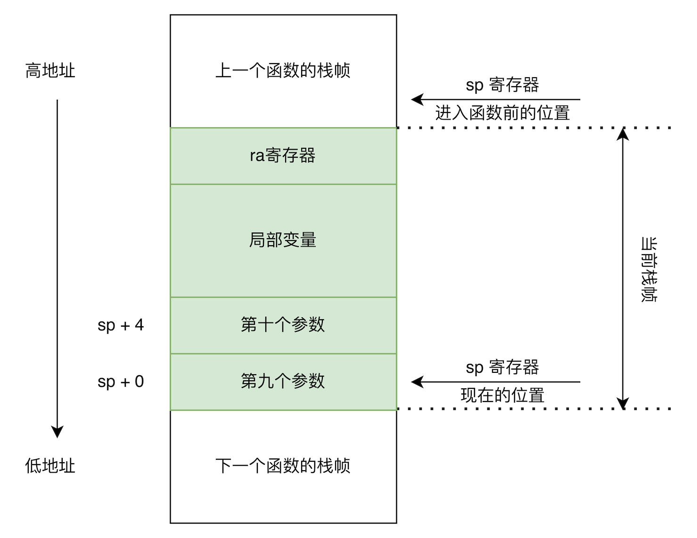

# Lv8.1. 函数定义和调用

本节新增/变更的语法规范如下:

```ebnf
CompUnit    ::= [CompUnit] FuncDef;

FuncDef     ::= FuncType IDENT "(" [FuncFParams] ")" Block;
FuncType    ::= "void" | "int";
FuncFParams ::= FuncFParam {"," FuncFParam};
FuncFParam  ::= BType IDENT;

UnaryExp    ::= ...
              | IDENT "(" [FuncRParams] ")"
              | ...;
FuncRParams ::= Exp {"," Exp};
```

## 一个例子

```c
int half(int x) {
  return x / 2;
}

void f() {}

int main() {
  f();
  return half(10);
}
```

## 词法/语法分析

本节新增了关键字 `void`, 你需要修改你的 lexer 来支持它们. 同时, 你需要针对发生变化的语法规则, 例如 `CompUnit`, `FuncDef` 等, 设计新的 AST, 并更新你的 parser 实现.

## 语义分析

本节 `CompUnit` 的定义发生了变化, 其允许多个不同的函数同时存在于全局范围内. 为了避免函数之间的重名, 你可以把全局范围内所有的函数 (包括之后章节中会出现的全局变量) 都放在同一个作用域内, 即全局作用域. 全局作用域应该位于所有局部作用域的外层, 你可以修改你的符号表使其支持这一特性.

## IR 生成

在 Koopa IR 中, 你可以像定义 `@main` 函数一样, 定义其他的函数. 如果函数有参数, 可以直接在函数名之后的括号内写明参数名称和类型. 使用上, 函数的形式参数变量和函数内的其他变量并无区别.

Koopa IR 中, 使用 `call 函数名(参数, ...)` 指令可以完成一次函数调用. `call` 指令是否具备返回值, 以及具备什么类型的返回值, 取决于指令所调用的函数的具体类型. 如果 `call` 指令不具备返回值, 则不能写为 `%v = call ...` 的形式.

对于返回值类型为 `void` 的函数, 定义函数时省略类型标注, 函数内使用 `ret` 指令时不需要附带返回值. 即, 函数需要返回时, 直接写 `ret` 即可.

示例程序生成的 Koopa IR 为:

```koopa
fun @half(@x: i32): i32 {
%entry:
  %x = alloc i32
  store @x, %x
  %0 = load %x
  %1 = div %0, 2
  ret %1
}

fun @f() {
%entry:
  ret
}

fun @main(): i32 {
%entry:
  call @f()
  %0 = call @half(10)
  ret %0
}
```

!> 本章引入了全局符号定义. 在 Koopa IR 中, 全局的符号不能和其他全局符号同名, 局部的符号 (位于函数内部的符号) 不能和其他全局符号以及局部符号同名. 上述规则对具名符号和临时符号都适用.

你可能会注意到, 在 `@half` 函数中, 我们为参数 `@x` 又单独分配了一块名为 `%x` 的内存空间. 直接使用 `@x` 不行吗? 比如像这样:

```koopa
fun @half(@x: i32): i32 {
%entry:
  %0 = div @x, 2
  ret %0
}
```

可以的, 完全正确! 但此处采取了看起来更繁琐的做法, 是为了方便目标代码生成部分的处理. 否则, 目标代码生成必须做复杂处理, 或者直接生成出错误的代码.

## 目标代码生成

目标代码生成部分无非涉及以下几个问题, 即, 在 RISC-V 汇编中:

* 如何定义函数?
* 如何调用函数?
* 如何传递/接收函数参数?
* 如何传递/接收返回值, 以及从函数中返回?

这些问题的基础, 都和 RISC-V 的调用约定, 以及栈帧的构造 (这其实也是调用约定的一部分) 相关. 建议你先回顾一下 [Lv4.2 中的相关内容](/lv4-const-n-var/var-n-assign?id=目标代码生成).

### 函数的调用和返回

RISC-V 中, `call` 和 `ret` 伪指令可以实现函数的调用和返回——确切的说, 其中的 `jalr` 指令实现了函数调用和返回中的关键操作: 跳转和保存返回地址. 当然, 从这两条指令的含义中我们得知:

1. 在汇编层面, “函数调用和返回” 并不包括参数和返回值的传递.
2. 函数的返回地址保存在寄存器 `ra` 中.

第二点告诉我们, 一旦一个函数中还会调用其他函数, 这个函数 (或另外的函数) 就必须保存/恢复自己的 `ra` 寄存器. 比如本节示例中的 `main` 函数调用了 `half` 函数和 `f` 函数, `main` 必须保存自己的 `ra`. 否则在调用其他函数时, `call` 指令会修改 `ra` 的值, 而 `main` 在执行 `ret` 时, `ra` 的值就不再是进入 `main` 时的值了, `main` 就无法返回到正确的位置, 只能在自己的函数体里无限循环.

把函数之间的调用关系想象成一个图 (即调用图, [call graph](https://en.wikipedia.org/wiki/Call_graph)), 那么一个永远不会调用其他函数的函数就位于图中的叶子结点, 我们把这种函数称为叶子函数 ([leaf function](https://en.wikipedia.org/wiki/Leaf_subroutine)). 与之相对的, 还有非叶子函数.

在 RISC-V 中, 非叶子函数通常需要在 prologue 中将自己的 `ra` 寄存器保存到栈帧中. 在 epilogue 中, 非叶子函数需要先从栈帧中恢复 `ra` 寄存器, 之后才能执行 `ret` 指令. 叶子函数可以不必进行上述操作——当然进行了也不会出问题, 只是会做一些无用功导致性能变差.

### 传递/接收参数

RISC-V 有 8 个寄存器: `a0`-`a7`, 它们专门用来在函数调用时传递函数的非浮点参数, 前提是函数参数可以被塞进这些寄存器 (在本课程中不会出现塞不进去的情况). 函数的前 8 个参数必须按照从前到后的顺序依次放入 `a0` 到 `a7` 寄存器.

那你可能会问:

> “如果函数参数超过 8 个怎么办?”

对于这种情况, RISC-V 的调用约定规定, 超出部分的参数必须放在 “调用者” 函数 (caller, 也就是调用超 8 个参数函数的那个函数) 的栈帧中. 具体来说, 第 9 个参数放在 `sp + 0` 的位置, 后续参数按照从前到后的顺序依次放在 `sp + 4` 及之后——当然, 这是建立在你传的参数的长度都是 32 位的基础上来讨论的. 具体如图所示:



所以, 函数在建立自己栈帧的时候, 必须给函数内所有超 8 个参数的函数调用留出足够大的空间, 来传递函数参数.

> “为什么这么麻烦啊?”

没办法, 写编译器就是一个入乡随俗的过程. 编译器必须得依着目标指令系统的性子, 生成格式正确的指令, 同时按照约定的规矩处理栈帧啊, 传参啊, 这啊那啊的一大堆破事. 所以, 下次编译器给你写的代码报错的时候, 记得好好哄哄编译器, 人家也不容易. 报警告的时候也得哄, 因为[警告和错误一样重要](/preface/facing-problems?id=面对问题完成实践的态度)!

> “写编译器的程序员也不容易啊, 那你能好好哄哄我吗?”

——哄……哄也不是不可以啦……

写文档的助教也不容易, 你能哄……哎, 人呢? 怎么跑了?

### 关于寄存器

目前对于大部分的 Koopa IR 变量, 包括 `alloc` 分配的内存, 以及其他指令的返回值, 你的编译器会把它们全部保存在栈帧里, 而不是寄存器上. 即便用到寄存器, 也只是诸如 `t0`-`t6` 的临时寄存器. 你有没有想过这些寄存器为什么叫 “临时寄存器”? 临时寄存器的含义又是什么?

RISC-V 的 [ABI](https://en.wikipedia.org/wiki/Application_binary_interface) 中, 32 个整数寄存器的名称和含义如下表所示:

| 寄存器    | ABI 名称  | 描述                | 保存者    |
| -         | -         | -                   | -         |
| `x0`      | `zero`    | 恒为 0              | N/A       |
| `x1`      | `ra`      | 返回地址            | 调用者    |
| `x2`      | `sp`      | 栈指针              | 被调用者  |
| `x3`      | `gp`      | 全局指针            | N/A       |
| `x4`      | `tp`      | 线程指针            | N/A       |
| `x5`      | `t0`      | 临时/备用链接寄存器 | 调用者    |
| `x6-7`    | `t1-2`    | 临时寄存器          | 调用者    |
| `x8`      | `s0`/`fp` | 保存寄存器/帧指针   | 被调用者  |
| `x9`      | `s1`      | 保存寄存器          | 被调用者  |
| `x10-11`  | `a0-1`    | 函数参数/返回值     | 调用者    |
| `x12-17`  | `a2-7`    | 函数参数            | 调用者    |
| `x18-27`  | `s2-11`   | 保存寄存器          | 被调用者  |
| `x28-31`  | `t3-6`    | 临时寄存器          | 调用者    |

ABI 中明确了 32 个整数寄存器的作用. 这些寄存器中, `x0` 硬件上无法被修改, `x2`-`x4` 软件上一旦被修改程序就会出问题, 剩下所有的寄存器可以用来随便存数据. 其中, `t0` 到 `t6` 这七个寄存器为临时寄存器, 这些寄存器是由 “调用者” 保存的, 即 “caller-saved”, 所以它们很适合用来存储临时数据.

在 ABI (或者说调用约定) 中, 保存寄存器的操作可以由两方来进行: 一方是负责调用函数的那个函数, 另一方是被调用的那个函数. 前者负责保存的寄存器叫 “调用者保存的寄存器” (caller-saved registers), 后者负责的叫 “被调用者保存的寄存器” (callee-saved register).

你可能听得一头雾水, 我换种说法: “调用者保存” 的寄存器, 在被调用的函数中可以随便乱写. 因为 ABI 规定这些寄存器已经被调用这个函数的函数保存在它自己的栈帧里了, 被调用的函数不需要操心怎么保存他们. 反之, 如果一个函数需要使用某些 “被调用者保存” 的寄存器, 在这个函数进入的时候 (即 prologue 中), 这个函数就必须把它要使用的这些寄存器保存一遍. 而对于这个函数的调用者, 在它看来, 调用函数前后, 所有 “被调用者保存” 的寄存器的内容都是不会发生变化的.

比如, 对于如下这个程序:

```
  li t0, 42
  call func
  addi t0, t0, 1
```

我们不能保证, `addi` 指令执行完成后, `t0` 一定是 43. 因为根据 ABI, `func` 不负责保存 `t0` 寄存器的值, 它可以往里随便写数据. 于是, `call` 指令执行完成后, `t0` 的值就未必是 42 了.

以上这个故事告诉我们, 你在实现编译器时, 必须按照 ABI 的要求使用 RISC-V 中的寄存器. 比如, 如果你的编译器会在生成某个函数的时候, 生成用到 `s0` 的指令, 编译器就必须同时在生成函数的 prologue/epilogue 时, 生成保存/恢复这个寄存器的指令. `t0`, `a0` 之类的寄存器可以随便用, 但你的编译器必须保证, 在需要读寄存器前不能进行函数调用, 否则寄存器的值有一定概率被破坏.

### 生成代码

由于本节引入了函数的定义和调用, 在生成代码时, 你需要考虑一些 ABI 相关的内容. 具体步骤如下:

1. 扫描 Koopa IR 程序中的每一个函数, 对所有的函数, 都像生成 `main` 一样生成代码.
2. 生成 prologue 之前, 扫描函数内的每条指令, 统计需要为局部变量分配的栈空间 $S$, 需要为 `ra` 分配的栈空间 $R$, 以及需要为传参预留的栈空间 $A$, 上述三个量的单位均为字节.
    * $R$ 的计算方法: 如果函数中出现了 `call`, 则为 4, 否则为 0.
    * $A$ 的计算方法: 设函数内有 $n$ 条 `call` 指令, $call_i$ 用到的参数个数为 $len_i$, 则 $A = \max \{ \max_{i=0}^{n-1} len_i - 8, 0 \}$
3. 计算 $S + R + A$, 向上取整到 16, 得到 $S^\prime$.
4. 生成 prologue: 首先, 根据 $S^\prime$ 生成 `addi` 指令来更新 `sp`. 然后, 如果 $R$ 不为 0, 在 $sp + S^\prime - 4$ 对应的栈内存中保存 `ra` 寄存器的值.
5. 生成函数体中的指令.
6. 如果遇到 Koopa IR 中的 `call` 指令, 你需要先将其所有参数变量的值读出, 存放到参数寄存器或栈帧中, 然后再生成 RISC-V 的 `call`.
7. 生成 epilogue: 如必要, 从栈帧中恢复 `ra` 寄存器. 然后, 复原 `sp` 寄存器的值. 最后生成 `ret`.

示例程序生成的 RISC-V 汇编为:

```
  .text
  .globl half
half:
  addi sp, sp, -16
  sw a0, 0(sp)
  lw t0, 0(sp)
  sw t0, 4(sp)
  lw t0, 4(sp)
  li t1, 2
  div t0, t0, t1
  sw t0, 8(sp)
  lw a0, 8(sp)
  addi sp, sp, 16
  ret

  .text
  .globl f
f:
  ret

  .text
  .globl main
main:
  addi sp, sp, -16
  sw ra, 12(sp)
  call f
  li a0, 10
  call half
  sw a0, 0(sp)
  lw a0, 0(sp)
  lw ra, 12(sp)
  addi sp, sp, 16
  ret
```
