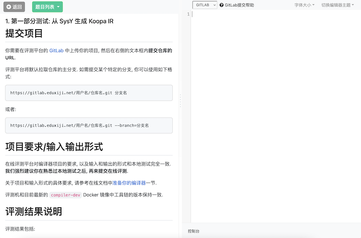
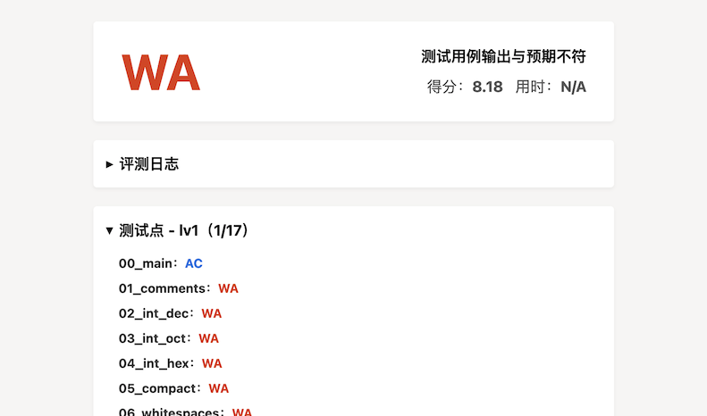

# 在线评测使用说明

为了方便我们对大家的作业进行公平公正的评分, 我们提供了一套在线评测系统, 用于评测大家的编译器实现.

在线评测系统的使用方式与其他的 Online Judging 系统 (例如 POJ) 类似, 要完成一次评测, 你需要:

1. 使用我们提供的[代码托管平台](https://gitlab.eduxiji.net), 管理你实现的编译器的源代码.
2. 使用我们发放的账号登录评测系统, 提交代码托管平台的仓库地址.
3. 等待评测系统完成下列操作:
    * 拉取并编译你的编译器,
    * 使用你的编译器编译所有测试用例,
    * 检测生成的测试用例的正确性.
4. 查看评测系统返回的评测结果. 你可能需要根据结果修改你的编译器, 将改动提交到你的仓库, 并回到第 2 步进行新一轮的评测.

## 提交代码

你可以使用发放的账号登录评测平台的代码托管平台 ([eduxiji.gitlab.net](https://gitlab.eduxiji.net)), 然后新建 repo. 之后你就可以按照使用 Git 的一般流程来向代码托管平台提交代码了.

!> **注意:** 请务必将你创建的 repo 的可见性设为 “Private”, 否则所有人都将在平台上看到你提交的代码!
<br><br>
此外, 平台的 GitLab **不支持 SSH 登录**, 在从平台 clone 仓库或向平台提交代码时, 请注意使用 HTTPS.

## 登录评测系统

你可以访问 [course.educg.net](https://course.educg.net) 来登录在线评测系统. 进入系统后, 你可以选择不同阶段的提交入口.

关于编译实践的评测入口和阶段划分, 请参考文档的[实验说明](/preface/lab)部分. 你需要选择合适的提交入口, 并在其中提交你的编译器仓库.

## 提交评测

选择并进入评测入口后, 你将看到如下的界面:



界面的右侧是代码编辑区域, 但请注意, 此处应该填写你的编译器仓库的 URL, 而**不是**你编译器的源代码. 例如:

```
https://gitlab.eduxiji.net/MaxXing/pku-minic-test.git
```

如果你需要提交仓库的某个分支, 你可以使用如下的格式:

```
https://gitlab.eduxiji.net/用户名/仓库名.git 分支名
```

或者:

```
https://gitlab.eduxiji.net/用户名/仓库名.git --branch=分支名
```

填写完成后, 点击 “提交” 按钮, 即可将代码提交至系统进行在线评测. 评测结果会在几分钟后展示在控制台窗口中.



## 项目要求/输入输出形式

在线评测平台对编译器项目的要求, 以及输入和输出的形式和本地测试完全一致, 即:

* 你的编译器需要支持形如 `compiler 模式 输入文件 -o 输出文件` 的命令行参数.
* 不同的评测入口会采用不同的 `模式` 调用你的编译器:
  * **从 SysY 生成 Koopa IR**: `-koopa`.
  * **从 SysY 生成 RISC-V 汇编**: `-riscv`.
  * **性能测试**: `-perf`.

**我们强烈建议你在熟悉过本地测试之后, 再来提交在线评测**.

关于项目和输入形式的具体要求, 请参考文档中[准备你的编译器](/misc-app-ref/environment?id=准备你的编译器)一节.

评测机和目前最新的 `compiler-dev` Docker 镜像中工具链的版本保持一致.

## 检查评测结果

评测完成后, 平台会返回评测结果. 评测结果包括:

* **GPE**: Git Pull Error, 评测机在拉取你的项目时出现了问题.
* **CCE**: Compile Compiler Error, 评测机在编译你提交的编译器项目时出现了问题.
* **CCTLE**: Compile Compiler Time Limit Exceeded, 评测机在编译你提交的编译器项目时超时 (超过 300s).
* **CTE**: Compile Testcase Error, 评测机在使用你提交的编译器编译测试用例时出现了问题.
* **CTTLE**: Compile Testcase Time Limit Exceeded, 评测机在使用你提交的编译器编译测试用例时超时 (编译单个用例的时间超过 120s).
* **ONF**: Output Not Found, 评测机在使用你提交的编译器编译测试用例时, 未检测到你的编译器向指定文件中输出任何内容.
* **AE**: Assemble Error, 评测机在汇编你的编译器生成的汇编代码时出现了问题.
* **ATLE**: Assemble Time Limit Exceeded, 评测机在汇编你的编译器生成的汇编代码时超时 (汇编单个用例的时间超过 60s).
* **RE**: Runtime Error, 评测机在运行你的编译器生成的测试用例时出现了问题.
* **RTLE**: Runtime Time Limit Exceeded, 评测机在运行你的编译器生成的测试用例时超时 (运行单个用例的时间超过 120s).
* **TIE**: Time Info Error, 评测机运行生成的测试用例时没有找到运行时间信息. 这个错误只会在进行性能测试时出现, 可能是因为你的编译器没有正确处理 `starttime`/`stoptime` 库函数.
* **WA**: Wrong Answer, 评测机运行生成的测试用例时, 检测到输出结果和预期输出不符.
* **AC**: Accepted, 所有功能测试的结果均正确.
* **SKIPPED**: Skipped, 已跳过当前测试用例.
* **SE**: System Error, 评测机出现了意料之中 (?) 的内部错误.
* **UE**: Unexpected Error, 评测机出现了不可预料的内部错误. 遇到这种情况时请立即联系助教, 评测机觉得自己还能再抢救一下.
