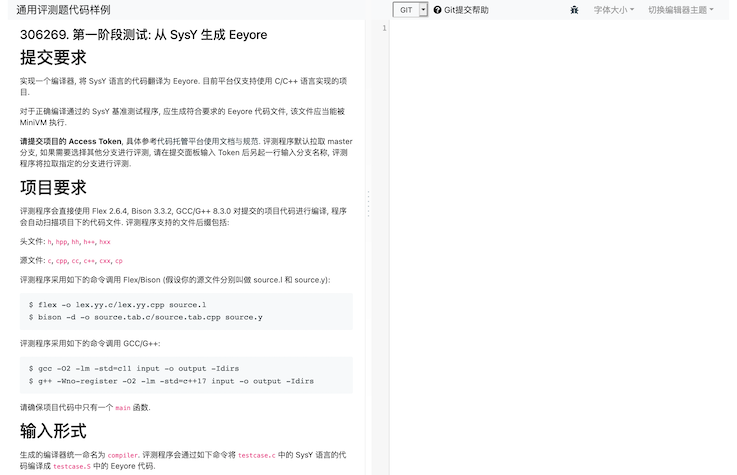
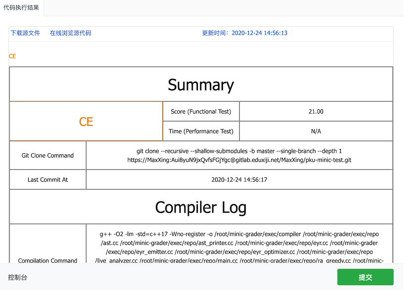

# 5.2. 开始评测

你可以访问 [course.educg.net](https://course.educg.net) 来登录在线评测系统. 进入系统后, 你可以选择不同阶段的提交入口. 你也许还记得[之前](ir/)我们曾说过, 本次课程实践实现的编译器可被分三个部分:

1. **第一部分**: 读取 SysY, 进行词法/语法/语义 (可选) 分析, 生成 Eeyore.
2. **第二部分**: 读取 Eeyore, 进行寄存器分配和部分优化 (可选), 生成 Tigger.
3. **第三部分**: 读取 Tigger, 进行部分优化 (可选), 生成 RISC-V 汇编.

对应的, 编译器的评测过程也被分为了三个阶段:

1. **第一阶段**: 从 SysY 生成 Eeyore.
2. **第二阶段**: 从 Eeyore 生成 Tigger.
3. **第三阶段**: 从 Tigger 生成 RISC-V 汇编.

但考虑到有些同学实现的编译器可能会横跨其中的若干阶段, 或者没有按照我们的阶段划分来实现编译器, 而是按自己的思路实现了从 SysY 语言到 RISC-V 的编译器, 我们为每个阶段扩展了不同的提交入口:

1. **第一阶段**:
    * 从 SysY 生成 Eeyore.
    * 从 SysY 生成 Tigger.
    * 从 SysY 生成 RISC-V 汇编.
2. **第二阶段**:
    * 从 Eeyore 生成 Tigger.
    * 从 Eeyore 生成 RISC-V 汇编.
3. **第三阶段**:
    * 从 Tigger 生成 RISC-V 汇编.

## 提交评测

首先选择一个评测入口, 你将看到如下的界面:



在提交前请仔细阅读界面左侧的内容, 它能帮助你解决大部分你可能会遇到的问题.

界面的右侧是代码编辑区域, 但请注意, 此处应该填写你在 [5.1 节](oj/committing.md)中提到的 repo URL, 而**不是**你编译器的源代码. 例如:

```
https://gitlab.eduxiji.net/MaxXing/pku-minic-test.git
```

如果你需要提交仓库的某个分支, 你可以使用如下的格式:

```
https://gitlab.eduxiji.net/用户名/仓库名.git 分支名
```

或者:

```
https://gitlab.eduxiji.net/用户名/仓库名.git --branch=分支名
```

填写完成后, 点击 “提交” 按钮, 即可将代码提交至系统进行在线评测. 评测结果会在几分钟后展示在控制台窗口中.



## 检查评测结果

评测完成后, 平台会返回评测结果. 评测结果包括:

* **GPE**: Git Pull Error, 评测机在拉取你的项目时出现了问题.
* **CCE**: Compile Compiler Error, 评测机在编译你提交的编译器项目时出现了问题.
* **CCTLE**: Compile Compiler Time Limit Exceeded, 评测机在编译你提交的编译器项目时超时 (超过 120s).
* **CTE**: Compile Testcase Error, 评测机在使用你提交的编译器编译测试用例时出现了问题.
* **CTTLE**: Compile Testcase Time Limit Exceeded, 评测机在使用你提交的编译器编译测试用例时超时 (编译单个用例的时间超过 120s).
* **AE**: Assemble Error, 评测机在汇编你的编译器生成的汇编代码时出现了问题.
* **ATLE**: Assemble Time Limit Exceeded, 评测机在汇编你的编译器生成的汇编代码时超时 (汇编单个用例的时间超过 60s).
* **RE**: Runtime Error, 评测机在运行你的编译器生成的测试用例时出现了问题.
* **RTLE**: Runtime Time Limit Exceeded, 评测机在运行你的编译器生成的测试用例时超时 (运行单个用例的时间超过 120s).
* **TIE**: Time Info Error, 评测机运行生成的测试用例时没有找到运行时间信息. 这个错误只会在进行性能测试时出现, 通常是因为你的编译器没有正确处理 `starttime`/`stoptime` 库函数.
* **WA**: Wrong Answer, 评测机运行生成的测试用例时, 检测到输出结果和预期输出不符.
* **AC**: Accepted, 所有功能测试的结果均正确.
* **SE**: System Error, 评测机出现了意料之中 (?) 的内部错误.
* **UE**: Unexpected Error, 评测机出现了不可预料的内部错误. 遇到这种情况时请立即联系助教, 评测机觉得自己还能再抢救一下.
